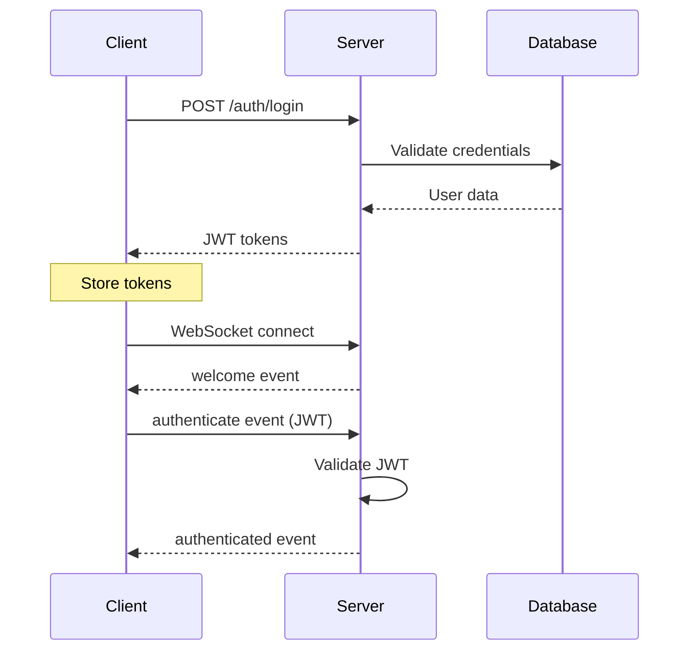
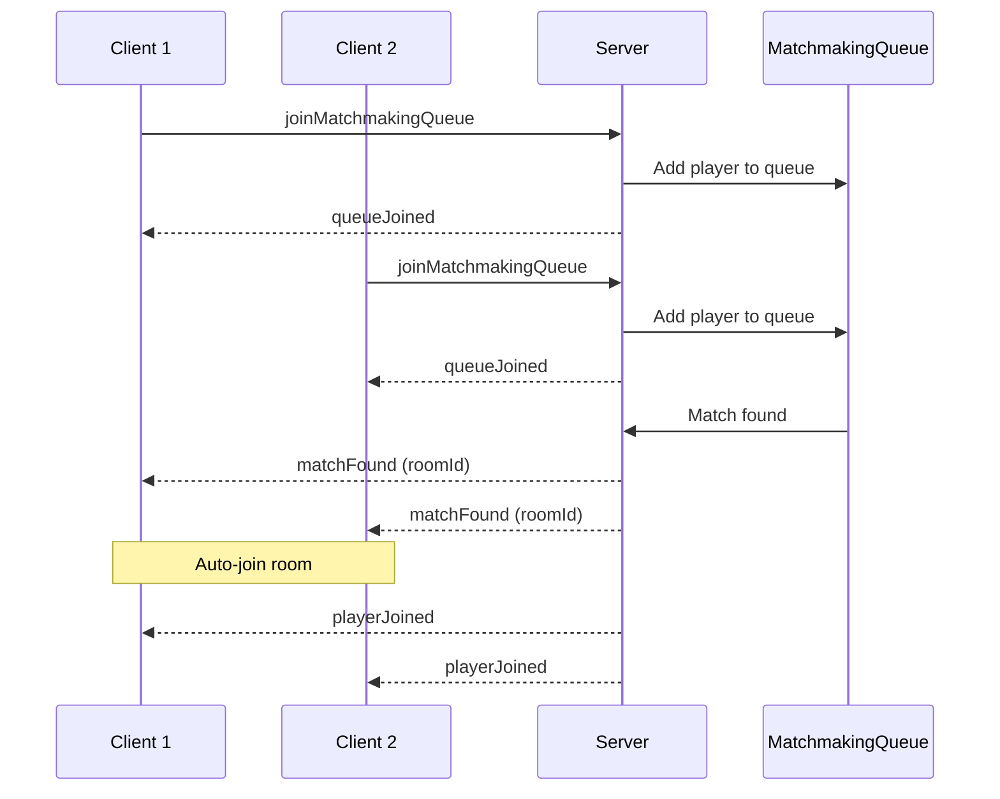
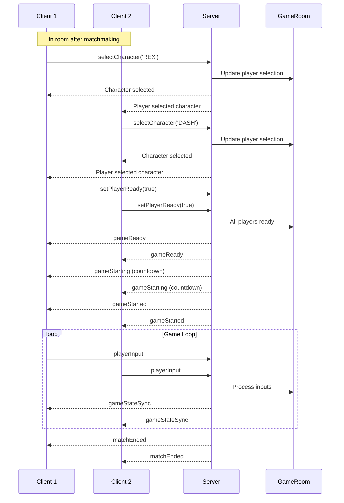

# API & WebSocket Reference Guide

This document provides comprehensive reference for the Brawl Bytes API endpoints and WebSocket events, including information flow patterns and practical examples.

## Table of Contents

1. [REST API Reference](#rest-api-reference)
2. [WebSocket Events Reference](#websocket-events-reference)
3. [Information Flow Patterns](#information-flow-patterns)
4. [Authentication Flow](#authentication-flow)
5. [Error Handling](#error-handling)
6. [Developer Guide](#developer-guide)

---

## REST API Reference

### Base URL
- **Development**: `http://localhost:3001`
- **Production**: Configured via `VITE_API_URL` environment variable

### Authentication Endpoints (`/auth`)

#### `POST /auth/register`
Register a new user account.

**Request Body:**
```json
{
  "username": "player123",
  "email": "player@example.com",
  "password": "securePassword123"
}
```

**Response (201 Created):**
```json
{
  "success": true,
  "message": "User registered successfully",
  "user": {
    "id": "user_123",
    "username": "player123",
    "email": "player@example.com"
  }
}
```

#### `POST /auth/login`
Authenticate user and receive JWT tokens.

**Request Body:**
```json
{
  "username": "player123",
  "password": "securePassword123"
}
```

**Response (200 OK):**
```json
{
  "success": true,
  "accessToken": "eyJhbGciOiJIUzI1NiIs...",
  "refreshToken": "eyJhbGciOiJIUzI1NiIs...",
  "user": {
    "id": "user_123",
    "username": "player123",
    "email": "player@example.com"
  }
}
```

#### `POST /auth/refresh`
Refresh access token using refresh token.

**Request Body:**
```json
{
  "refreshToken": "eyJhbGciOiJIUzI1NiIs..."
}
```

**Response (200 OK):**
```json
{
  "success": true,
  "accessToken": "eyJhbGciOiJIUzI1NiIs...",
  "refreshToken": "eyJhbGciOiJIUzI1NiIs..."
}
```

#### `GET /auth/profile`
Get current user profile (requires authentication).

**Headers:**
```
Authorization: Bearer <access_token>
```

**Response (200 OK):**
```json
{
  "success": true,
  "user": {
    "id": "user_123",
    "username": "player123",
    "email": "player@example.com"
  }
}
```

### Game Constants API (`/api/constants`)

#### `GET /api/constants`
Get all game constants.

**Response (200 OK):**
```json
{
  "physics": {
    "gravity": 2400,
    "jumpForce": 800,
    "moveSpeed": 350
  },
  "combat": {
    "baseDamage": 25,
    "comboMultiplier": 1.25,
    "blockReduction": 0.5
  },
  "game": {
    "roundDuration": 90,
    "maxRounds": 3,
    "countdownDuration": 3
  }
}
```

#### `GET /api/constants/:category`
Get constants by category (physics, combat, game).

**Response (200 OK):**
```json
{
  "gravity": 2400,
  "jumpForce": 800,
  "moveSpeed": 350
}
```

#### `GET /api/constants/:category/:name`
Get specific constant value.

**Response (200 OK):**
```json
{
  "value": 2400,
  "category": "physics",
  "name": "gravity"
}
```

### Characters API (`/api/characters`)

#### `GET /api/characters`
Get all available characters.

**Response (200 OK):**
```json
[
  {
    "id": "REX",
    "name": "Rex",
    "stats": {
      "health": 100,
      "speed": 350,
      "jumpForce": 800
    },
    "abilities": ["dash", "uppercut", "combo"]
  }
]
```

#### `GET /api/characters/:id`
Get specific character data.

**Response (200 OK):**
```json
{
  "id": "REX",
  "name": "Rex",
  "stats": {
    "health": 100,
    "speed": 350,
    "jumpForce": 800
  },
  "abilities": ["dash", "uppercut", "combo"]
}
```

### Stages API (`/api/stages`)

#### `GET /api/stages`
Get all available stages.

**Response (200 OK):**
```json
[
  {
    "id": "BATTLE_ARENA",
    "name": "Battle Arena",
    "dimensions": {
      "width": 1920,
      "height": 1080
    },
    "platforms": [
      {
        "x": 0,
        "y": 900,
        "width": 1920,
        "height": 180
      }
    ]
  }
]
```

### Health Check (`/health`)

#### `GET /health`
Check server health status.

**Response (200 OK):**
```json
{
  "status": "healthy",
  "timestamp": "2024-01-15T10:30:00Z",
  "uptime": 3600
}
```

---

## WebSocket Events Reference

### Connection Management

#### Client Events (Client → Server)

##### `authenticate`
Authenticate socket connection with JWT token.

**Payload:**
```typescript
{
  token: string; // JWT access token
}
```

**Response Events:**
- `authenticated` - Success
- `authenticationFailed` - Failure

##### `createRoom`
Create a new game room.

**Payload:** None

**Response Events:**
- `roomCreated` - Success
- `roomError` - Failure

##### `joinRoom`
Join an existing game room.

**Payload:**
```typescript
{
  roomId: string;
}
```

**Response Events:**
- `playerJoined` - Success
- `roomError` - Failure

##### `leaveRoom`
Leave current game room.

**Payload:** None

**Response Events:**
- `playerLeft` - Success

##### `requestRoomState`
Request current room state.

**Payload:** None

**Response Events:**
- `roomStateSync` - Room state data

#### Server Events (Server → Client)

##### `welcome`
Initial connection acknowledgment.

**Payload:**
```typescript
{
  serverId: string;
  timestamp: number;
}
```

##### `authenticated`
Authentication success confirmation.

**Payload:**
```typescript
{
  success: true;
  user: {
    id: string;
    username: string;
    email: string;
  };
}
```

##### `authenticationFailed`
Authentication failure notification.

**Payload:**
```typescript
{
  success: false;
  error: string;
}
```

##### `roomCreated`
Room creation success.

**Payload:**
```typescript
{
  roomId: string;
  playerId: string;
  playerCount: number;
  maxPlayers: number;
}
```

##### `playerJoined`
Player joined room notification.

**Payload:**
```typescript
{
  playerId: string;
  username: string;
  roomId: string;
  playerCount: number;
  maxPlayers: number;
}
```

##### `playerLeft`
Player left room notification.

**Payload:**
```typescript
{
  playerId: string;
  username: string;
  roomId: string;
  playerCount: number;
}
```

##### `roomStateSync`
Complete room state synchronization.

**Payload:**
```typescript
{
  roomId: string;
  players: Array<{
    id: string;
    username: string;
    ready: boolean;
    character?: string;
    stage?: string;
  }>;
  gameState: 'waiting' | 'character_select' | 'playing' | 'paused' | 'ended';
  settings: {
    maxPlayers: number;
    roundDuration: number;
    maxRounds: number;
  };
}
```

### Matchmaking Events

#### Client Events

##### `joinMatchmakingQueue`
Join the matchmaking queue.

**Payload:**
```typescript
{
  preferences?: {
    preferredStage?: string;
    skillLevel?: number;
  };
}
```

##### `leaveMatchmakingQueue`
Leave the matchmaking queue.

**Payload:** None

#### Server Events

##### `queueJoined`
Queue join confirmation.

**Payload:**
```typescript
{
  position: number;
  estimatedWaitTime: number;
}
```

##### `matchFound`
Match found notification.

**Payload:**
```typescript
{
  roomId: string;
  players: Array<{
    id: string;
    username: string;
  }>;
  countdown: number;
}
```

### Game Events

#### Client Events

##### `selectCharacter`
Select character for match.

**Payload:**
```typescript
{
  characterId: string; // 'REX', 'DASH', 'TITAN'
}
```

##### `selectStage`
Select stage for match.

**Payload:**
```typescript
{
  stageId: string; // 'BATTLE_ARENA', etc.
}
```

##### `setPlayerReady`
Set player ready state.

**Payload:**
```typescript
{
  ready: boolean;
}
```

##### `startGame`
Start the game (when all players ready).

**Payload:** None

##### `playerInput`
Send player input during gameplay.

**Payload:**
```typescript
{
  playerId: string;
  inputType: 'move' | 'jump' | 'attack' | 'block' | 'special';
  data: {
    direction?: 'left' | 'right';
    position?: { x: number; y: number };
    velocity?: { x: number; y: number };
    attack?: {
      type: 'punch' | 'kick' | 'special';
      damage: number;
      hitbox: { x: number; y: number; width: number; height: number };
    };
  };
  sequence: number;
  timestamp: number;
}
```

#### Server Events

##### `gameReady`
Game ready to start notification.

**Payload:**
```typescript
{
  roomId: string;
  players: Array<{
    id: string;
    username: string;
    character: string;
    ready: boolean;
  }>;
  stage: string;
}
```

##### `gameStarting`
Game starting countdown.

**Payload:**
```typescript
{
  countdown: number;
  stage: string;
  players: Array<{
    id: string;
    username: string;
    character: string;
    spawn: { x: number; y: number };
  }>;
}
```

##### `gameStarted`
Game has started.

**Payload:**
```typescript
{
  roomId: string;
  startTime: number;
  roundNumber: number;
  players: Array<{
    id: string;
    username: string;
    character: string;
    position: { x: number; y: number };
    health: number;
  }>;
}
```

##### `gameStateSync`
Real-time game state synchronization.

**Payload:**
```typescript
{
  timestamp: number;
  players: Array<{
    id: string;
    position: { x: number; y: number };
    velocity: { x: number; y: number };
    health: number;
    state: 'idle' | 'moving' | 'jumping' | 'attacking' | 'blocking' | 'stunned';
    facing: 'left' | 'right';
  }>;
  projectiles: Array<{
    id: string;
    position: { x: number; y: number };
    velocity: { x: number; y: number };
    owner: string;
  }>;
  effects: Array<{
    id: string;
    type: 'hit' | 'block' | 'explosion';
    position: { x: number; y: number };
    duration: number;
  }>;
}
```

##### `gameEvent`
Specific game events (hits, blocks, etc.).

**Payload:**
```typescript
{
  type: 'hit' | 'block' | 'ko' | 'round_end' | 'match_end';
  timestamp: number;
  data: {
    attacker?: string;
    defender?: string;
    damage?: number;
    position?: { x: number; y: number };
    winner?: string;
    score?: { [playerId: string]: number };
  };
}
```

##### `matchEnded`
Match completion notification.

**Payload:**
```typescript
{
  winner: string;
  score: { [playerId: string]: number };
  duration: number;
  stats: {
    [playerId: string]: {
      damageDealt: number;
      damageReceived: number;
      hitsLanded: number;
      blockedAttacks: number;
    };
  };
}
```

### Connection Events

##### `gamePaused`
Game paused due to disconnection.

**Payload:**
```typescript
{
  reason: string;
  disconnectedPlayer?: {
    userId: string;
    username: string;
  };
  gracePeriod: number; // seconds
}
```

##### `gameResumed`
Game resumed after reconnection.

**Payload:**
```typescript
{
  resumeTime: number;
  reconnectedPlayer?: {
    userId: string;
    username: string;
  };
}
```

##### `matchTimeout`
Match timed out due to extended disconnection.

**Payload:**
```typescript
{
  reason: 'player_timeout' | 'server_timeout';
  disconnectedPlayer?: {
    userId: string;
    username: string;
  };
}
```

---

## Information Flow Patterns

### 1. User Authentication Flow



### 2. Matchmaking Flow



### 3. Game Session Flow



### 4. Disconnection & Reconnection Flow

```mermaid
sequenceDiagram
    participant C1 as Client 1
    participant C2 as Client 2
    participant S as Server
    participant GR as GameRoom
    
    Note over C1,C2,S: Game in progress
    
    C1->>S: disconnect (network issue)
    S->>GR: Player disconnected
    S-->>C2: gamePaused (grace period: 30s)
    
    Note over S: 30-second grace period
    
    alt Reconnection within grace period
        C1->>S: reconnect
        C1->>S: authenticate
        S->>GR: Player reconnected
        S-->>C1: gameStateSync (current state)
        S-->>C2: gameResumed
    else Timeout exceeded
        S->>GR: Remove player
        S-->>C2: matchTimeout
        S->>GR: End match
    end
```

---

## Authentication Flow

### Token Management

1. **Access Token**: Short-lived (15 minutes), used for API requests
2. **Refresh Token**: Long-lived (30 days), used to obtain new access tokens
3. **Socket Authentication**: Uses access token for WebSocket connection

### Storage

```typescript
// Frontend token storage
localStorage.setItem('accessToken', response.accessToken);
localStorage.setItem('refreshToken', response.refreshToken);

// Socket authentication
const token = localStorage.getItem('accessToken');
socket.emit('authenticate', token);
```

### Auto-Refresh

```typescript
// Automatic token refresh before expiration
const refreshToken = async () => {
  const refreshToken = localStorage.getItem('refreshToken');
  const response = await fetch('/auth/refresh', {
    method: 'POST',
    headers: { 'Content-Type': 'application/json' },
    body: JSON.stringify({ refreshToken })
  });
  
  const data = await response.json();
  localStorage.setItem('accessToken', data.accessToken);
  localStorage.setItem('refreshToken', data.refreshToken);
};
```

---

## Error Handling

### HTTP API Errors

**Standard Error Response:**
```json
{
  "success": false,
  "error": "Error message",
  "code": "ERROR_CODE",
  "details": {}
}
```

**Common Error Codes:**
- `INVALID_CREDENTIALS` - Authentication failed
- `TOKEN_EXPIRED` - Access token expired
- `VALIDATION_ERROR` - Input validation failed
- `NOT_FOUND` - Resource not found
- `RATE_LIMITED` - Too many requests
- `INTERNAL_ERROR` - Server error

### WebSocket Errors

**Error Event:**
```typescript
socket.on('error', (error) => {
  console.error('Socket error:', error);
});
```

**Common Error Scenarios:**
- Authentication timeout
- Room not found
- Player not in room
- Game state mismatch
- Network connectivity issues

### Connection State Management

```typescript
enum ConnectionState {
  DISCONNECTED = 'disconnected',
  CONNECTING = 'connecting',
  CONNECTED = 'connected',
  AUTHENTICATED = 'authenticated',
  ERROR = 'error'
}

// Connection state tracking
const socketManager = getSocketManager();
socketManager.on('connectionStateChanged', (state) => {
  switch (state) {
    case ConnectionState.ERROR:
      // Handle connection error
      break;
    case ConnectionState.AUTHENTICATED:
      // Ready for gameplay
      break;
  }
});
```

---

## Developer Guide

### Adding New API Endpoints

1. **Create Route Handler** (`/backend/src/routes/`)
2. **Add Validation** (express-validator)
3. **Implement Controller** (`/backend/src/controllers/`)
4. **Update Frontend Service** (`/frontend/src/services/`)
5. **Add Type Definitions** (`/frontend/src/types/`)

### Adding New WebSocket Events

1. **Define Event in Constants** (`/frontend/src/types/Network.ts`)
2. **Add Server Handler** (`/backend/src/networking/SocketManager.ts`)
3. **Update Client Handler** (`/frontend/src/utils/socket.ts`)
4. **Add Type Definitions** (`/frontend/src/types/Network.ts`)

### Testing WebSocket Events

```typescript
// Test WebSocket events
const mockSocket = {
  emit: jest.fn(),
  on: jest.fn(),
  off: jest.fn()
};

// Test authentication
mockSocket.emit('authenticate', 'test-token');
expect(mockSocket.emit).toHaveBeenCalledWith('authenticate', 'test-token');
```

### Debugging Connection Issues

1. **Check Connection State**
2. **Verify Authentication**
3. **Monitor Network Tab**
4. **Check Server Logs**
5. **Test with Multiple Clients**

### Performance Considerations

1. **Rate Limiting**: Implement client-side rate limiting
2. **Message Batching**: Batch rapid updates
3. **Connection Pooling**: Reuse connections
4. **Graceful Degradation**: Handle poor connections
5. **Memory Management**: Clean up event listeners

---

## Configuration

### Environment Variables

```env
# Frontend (.env)
VITE_API_URL=http://localhost:3001
VITE_SOCKET_URL=http://localhost:3001

# Backend (.env)
PORT=3001
DATABASE_URL=postgresql://...
JWT_SECRET=your-secret-key
JWT_EXPIRES_IN=15m
REFRESH_TOKEN_EXPIRES_IN=30d
```

### Socket Configuration

```typescript
// Client configuration
const socketConfig = {
  url: import.meta.env.VITE_SOCKET_URL,
  reconnectionAttempts: 5,
  reconnectionDelay: 1000,
  timeout: 20000
};

// Server configuration
const io = new Server(server, {
  cors: {
    origin: process.env.FRONTEND_URL,
    credentials: true
  },
  pingTimeout: 60000,
  pingInterval: 25000
});
```

This reference guide provides the complete API and WebSocket specification for the Brawl Bytes multiplayer fighting game, enabling developers to understand and work with the real-time communication system effectively.