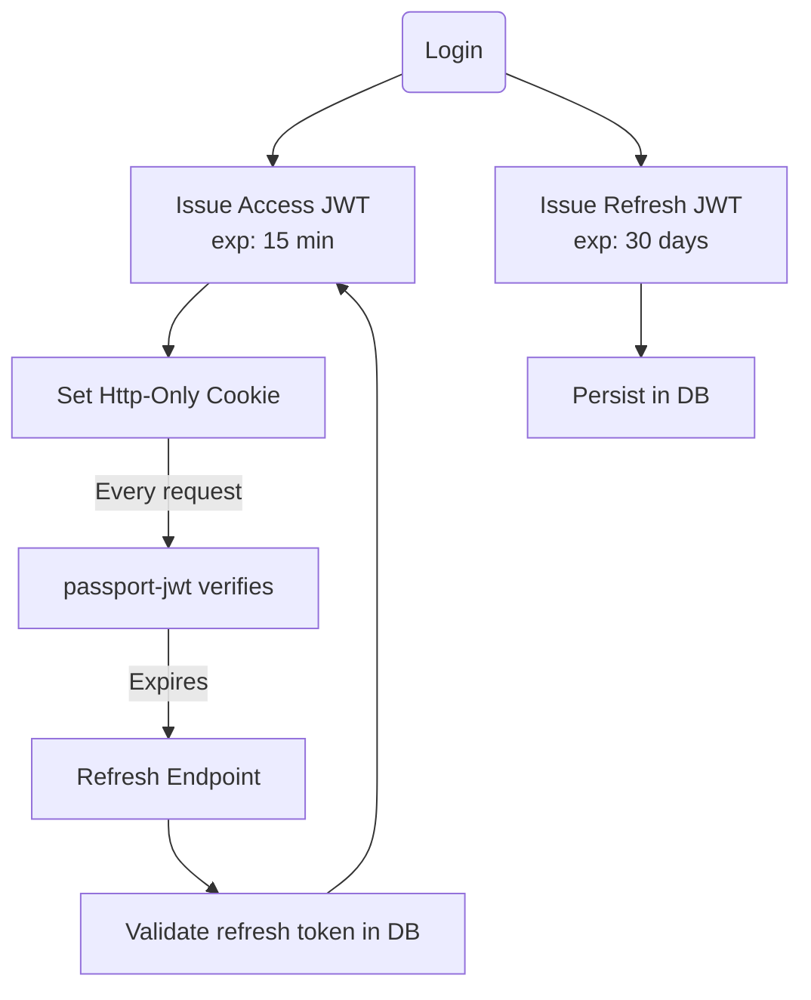

# Authentication Strategy

> **Purpose:** Define how Brawl Bytes handles user authentication and authorization across REST APIs and real-time Socket.io communication.

---

## Framework Choice

| Concern | Decision |
|---------|----------|
| **Library** | **Passport.js** (TypeScript) |
| **Primary Strategies** | `passport-local` (credentials) + `passport-jwt` (access & refresh tokens) |
| **Optional OAuth** | Google & Discord via Passport strategies |
| **Session Model** | **Stateless JWT** (no server-side session store) |
| **Persistence** | Refresh tokens persisted in `user_sessions` table |

Why Passport?
1. Mature, battle-tested, 10 k+ GitHub stars.
2. Hundreds of ready-made OAuth strategies = quick social login support.
3. Plugs directly into Express middleware chain used by the backend.
4. Works for REST *and* WebSocket authentication guards.

---

## Token Design



| Token | Lifetime | Transport | Purpose |
|-------|----------|-----------|---------|
| **Access JWT** | 15 min | `Authorization: Bearer` header (or Socket.io auth) | Protect REST & WS routes |
| **Refresh JWT** | 30 days | Http-Only cookie | Obtain new access tokens |

Both tokens include: `sub` (user-id), `iat`, `exp`, `jti` (unique token id).

---

## Passport Strategy Setup (code sketch)

```ts
// backend/src/auth/strategy.local.ts
import passportLocal from 'passport-local';
import bcrypt from 'bcrypt';
import { prisma } from '../database/prisma/client';

export const LocalStrategy = new passportLocal.Strategy(
  { usernameField: 'email', passwordField: 'password' },
  async (email, password, done) => {
    const user = await prisma.user.findUnique({ where: { email } });
    if (!user) return done(null, false, { message: 'User not found' });
    const valid = await bcrypt.compare(password, user.passwordHash);
    return valid ? done(null, user) : done(null, false, { message: 'Invalid credentials' });
  }
);
```

```ts
// backend/src/auth/strategy.jwt.ts
import { Strategy as JwtStrategy, ExtractJwt } from 'passport-jwt';
import { prisma } from '../database/prisma/client';

export const JwtAccessStrategy = new JwtStrategy(
  {
    jwtFromRequest: ExtractJwt.fromAuthHeaderAsBearerToken(),
    secretOrKey: process.env.JWT_SECRET,
  },
  async (payload, done) => {
    const user = await prisma.user.findUnique({ where: { id: payload.sub } });
    return user ? done(null, user) : done(null, false);
  }
);
```

*Refresh tokens* are verified in a dedicated controller that cross-checks the `jti` against `user_sessions`.

---

## Endpoint Reference

| Method | Path | Middleware | Description |
|--------|------|------------|-------------|
| `POST` | `/auth/register` | none | Create account (hashes pwd, commits user, returns tokens) |
| `POST` | `/auth/login` | `passport.authenticate('local')` | Issue tokens |
| `POST` | `/auth/refresh` | `validateRefreshToken` | Rotate tokens |
| `POST` | `/auth/logout` | `passport.authenticate('jwt')` | Invalidate refresh token row |
| `GET`  | `/profile/me` | `passport.authenticate('jwt')` | Current user payload |

---

## Socket.io Authentication

1. Client connects with `auth: { token: <access-jwt> }` option.
2. `io.use(passportJwtMiddleware)` validates the token before `connection` event.
3. Invalid token → connection refused.

---

## Required Environment Variables

```env
# Access token secret & expiry (already present)
JWT_SECRET="..."
JWT_EXPIRES_IN="15m"

# NEW – Refresh token settings
JWT_REFRESH_EXPIRES_IN="30d"

# Optional OAuth
OAUTH_GOOGLE_CLIENT_ID=""
OAUTH_GOOGLE_CLIENT_SECRET=""
OAUTH_DISCORD_CLIENT_ID=""
OAUTH_DISCORD_CLIENT_SECRET=""
```

---

## Implementation Tasks

1. Install deps: `npm i passport passport-local passport-jwt bcrypt jsonwebtoken`.
2. Scaffold `/backend/src/auth/` folder (strategies, controllers, routes, helpers).
3. Integrate `passport.initialize()` & route guards in `server.ts`.
4. Add refresh-token controller + DB migration for `user_sessions`.
5. Update documentation & CI tests for auth flows.

---

## Acceptance Criteria

- [ ] Register + Login endpoints return 200 & valid JWTs.
- [ ] Protected route refuses unauthenticated requests.
- [ ] Refresh endpoint rotates token and invalidates old `jti`.
- [ ] Socket.io connection closes on invalid/expired token.
- [ ] Jest integration tests cover auth happy-paths & error cases. 