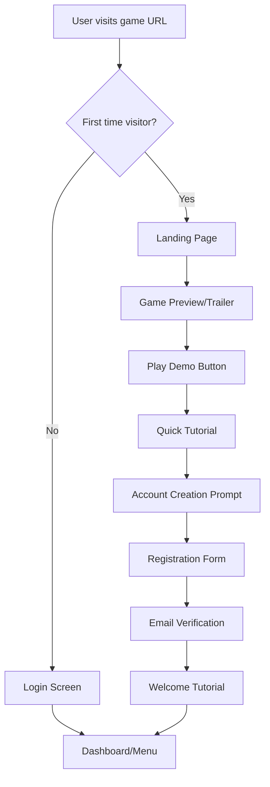
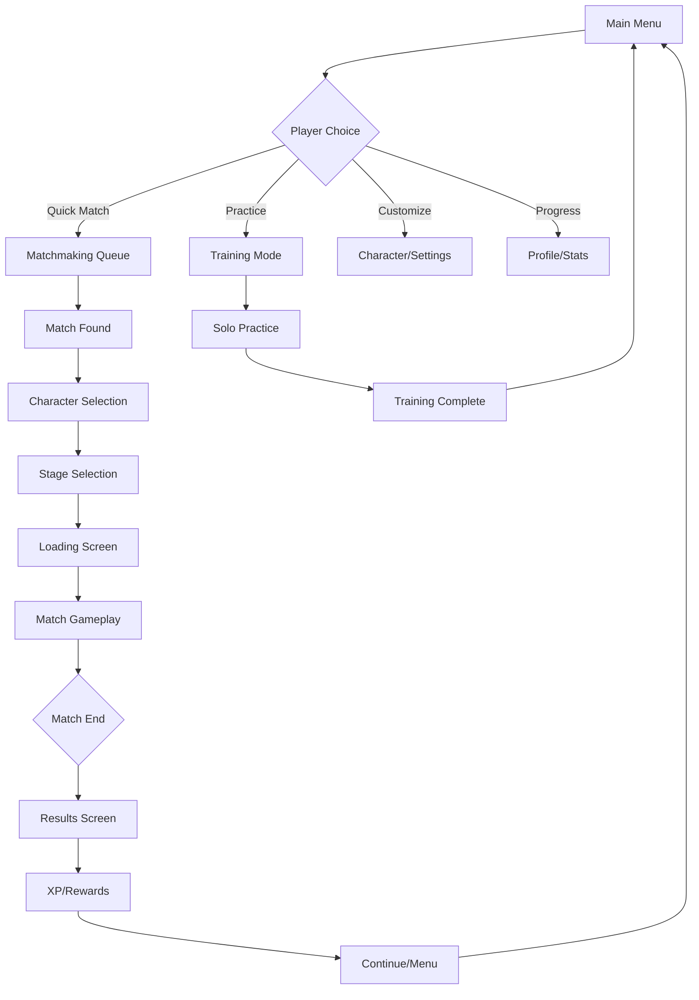

# User Flow & Experience Design

## Overview

This document maps out the complete user journey in Brawl Bytes, from first visit to competitive play. It defines user flows, interface designs, and experience optimization strategies to ensure smooth onboarding and engaging gameplay.

## User Journey Map

### 1. Discovery & First Visit



### 2. Onboarding Flow

```typescript
interface OnboardingFlow {
  steps: [
    'welcome_screen',
    'basic_tutorial',
    'character_introduction',
    'first_match',
    'progression_explanation',
    'feature_overview'
  ];
  
  skipOptions: {
    allowSkip: true;
    skipAfterStep: 2; // Can skip after basic tutorial
    veteranPlayerDetection: true;
  };
  
  progressTracking: {
    saveProgress: true;
    resumeOnReturn: true;
    completionRewards: {
      coins: 100;
      characterUnlock: 'warrior';
      achievementBadge: 'newcomer';
    };
  };
}
```

### 3. Core Game Loop



## Detailed User Flows

### 1. New User Onboarding

#### Step 1: Landing Page Experience
```typescript
interface LandingPageFlow {
  // Hero section
  heroContent: {
    title: "Brawl Bytes - Epic Multiplayer Combat";
    subtitle: "Fast-paced fighting action in your browser";
    ctaButton: "Play Now - Free";
    // [POST-MVP] backgroundVideo removed for MVP simplicity
  };
  
  // Feature highlights
  keyFeatures: [
    { icon: "⚡", title: "Instant Play", description: "No downloads required" },
    { icon: "🎮", title: "Cross-Platform", description: "Play on any device" },
    { icon: "🏆", title: "Competitive", description: "Ranked matchmaking" },
    { icon: "🎨", title: "Customizable", description: "Unlock characters & stages" }
  ];
  
  // Social proof
  socialProof: {
    playerCount: "10,000+ players online";
    rating: "4.8/5 stars";
    testimonials: true;
  };
}
```

#### Step 2: Quick Demo Experience
```typescript
interface DemoFlow {
  // Immediate gameplay without registration
  demoFeatures: {
    playableCharacter: 'warrior'; // Pre-selected
    aiOpponent: 'static_dummy'; // Dummy target; AI bots will be added post-MVP
    stage: 'training_arena';
    timeLimit: 60; // seconds
    tutorialHints: true;
  };
  
  // Demo completion
  demoEnd: {
    encouragementMessage: "Great job! Ready for real matches?";
    registrationPrompt: {
      benefits: [
        "Save your progress",
        "Unlock new characters",
        "Compete in ranked matches",
        "Track your stats"
      ];
      registrationCTA: "Create Free Account";
      guestContinue: "Continue as Guest";
    };
  };
}
```

#### Step 3: Registration & Account Setup
```typescript
interface RegistrationFlow {
  // Streamlined registration
  registrationForm: {
    requiredFields: ['username', 'email', 'password'];
    optionalFields: ['displayName', 'region'];
    socialLogin: ['google', 'discord'];
    validation: {
      usernameUnique: true;
      passwordStrength: 'medium';
      emailVerification: true;
    };
  };
  
  // Profile customization
  profileSetup: {
    avatarSelection: true;
    regionSelection: true;
    preferredGameModes: ['casual', 'ranked', 'practice'];
    privacySettings: {
      profileVisibility: 'public';
      friendRequests: 'everyone';
      matchHistory: 'friends';
    };
  };
}
```

### 2. Main Menu Navigation

```typescript
interface MainMenuFlow {
  // Primary navigation
  mainSections: {
    play: {
      quickMatch: "Find game instantly";
      ranked: "Competitive matchmaking";
      practice: "Train against AI";
      custom: "Private matches";
    };
    
    progress: {
      profile: "View stats & achievements";
      characters: "Unlock & customize";
      stages: "Explore battlegrounds";
      leaderboard: "See top players";
    };
    
    social: {
      friends: "Manage friend list";
      chat: "Community discussions";
      tournaments: "Competitive events";
      replays: "Watch match replays";
    };
    
    settings: {
      gameplay: "Controls & preferences";
      audio: "Sound & music";
      graphics: "Visual settings";
      account: "Profile & privacy";
    };
  };
  
  // Quick actions
  quickActions: {
    notifications: "Recent activity";
    dailyRewards: "Login bonuses";
    challenges: "Daily/weekly tasks";
    news: "Game updates";
  };
}
```

### 3. Matchmaking Flow

#### Casual Matchmaking
```typescript
interface CasualMatchmakingFlow {
  // Queue entry
  queueEntry: {
    gameMode: 'casual';
    playerCount: 4;
    estimatedWaitTime: 30; // seconds
    cancelOption: true;
  };
  
  // Matchmaking process
  matchmakingSteps: [
    'searching_players',
    'evaluating_skill',
    'selecting_stage',
    'creating_lobby',
    'match_found'
  ];
  
  // Match preparation
  matchPrep: {
    characterSelection: {
      timeLimit: 30; // seconds
      showPlayerChoices: true;
      allowChanges: true;
    };
    
    stageSelection: {
      votingSystem: true;
      randomFallback: true;
      bannedStages: [];
    };
  };
}
```

#### Ranked Matchmaking
```typescript
interface RankedMatchmakingFlow {
  // Rank requirements
  rankRequirements: {
    minimumLevel: 5;
    placementMatches: 10;
    seasonalReset: true;
  };
  
  // Enhanced matchmaking
  rankedFeatures: {
    skillBasedMatching: true;
    rankDisplay: true;
    ratingChange: true;
    winStreakBonus: true;
  };
  
  // Pre-match ritual
  rankedPrep: {
    warmupTime: 60; // seconds
    strategyDiscussion: false; // No chat
    characterBans: true;
    stageBans: true;
  };
}
```

### 4. In-Game Experience Flow

#### Match Gameplay
```typescript
interface GameplayFlow {
  // Match phases
  matchPhases: {
    loading: {
      duration: 5; // seconds
      tips: true;
      playerInfo: true;
    };
    
    countdown: {
      duration: 3; // seconds
      readyCheck: true;
      lastChance: true;
    };
    
    gameplay: {
      timeLimit: 180; // seconds
      pauseOption: false; // Competitive integrity
      spectatorMode: true;
    };
    
    results: {
      duration: 10; // seconds
      statsDisplay: true;
      replayOption: true;
    };
  };
  
  // UI elements during match
  gameplayUI: {
    healthBars: true;
    stockCounters: true;
    timer: true;
    minimapToggle: false;
    chatToggle: false; // Focus on gameplay
  };
}
```

#### Post-Match Experience
```typescript
interface PostMatchFlow {
  // Immediate feedback
  matchResults: {
    winnerAnnouncement: true;
    individualStats: {
      damage: true;
      accuracy: true;
      combos: true;
      survival: true;
    };
    
    comparison: {
      vsOpponents: true;
      personalBest: true;
      averagePerformance: true;
    };
  };
  
  // Progression rewards
  rewards: {
    experience: {
      baseXP: 50;
      winBonus: 25;
      performanceBonus: 0-50;
      firstWinBonus: 100;
    };
    
    currency: {
      coins: 10-25;
      gems: 0-5; // Rare
    };
    
    unlocks: {
      characters: true;
      stages: true;
      achievements: true;
    };
  };
  
  // Next actions
  nextActions: {
    playAgain: "Queue for another match";
    viewReplay: "Watch match replay";
    shareResults: "Share on social media";
    returnToMenu: "Main menu";
  };
}
```

### 5. Character & Progression Flow

#### Character Selection
```typescript
interface CharacterSelectionFlow {
  // Character browsing
  characterBrowser: {
    gridLayout: true;
    filterOptions: ['unlocked', 'locked', 'favorite'];
    sortOptions: ['name', 'unlock_order', 'win_rate'];
    previewMode: true;
  };
  
  // Character details
  characterDetails: {
    statsDisplay: true;
    abilityPreview: true;
    skinVariations: true;
    unlockRequirements: true;
  };
  
  // Selection confirmation
  selectionProcess: {
    hoverPreview: true;
    clickToSelect: true;
    confirmationRequired: false;
    lastUsedDefault: true;
  };
}
```

#### Progression System
```typescript
interface ProgressionFlow {
  // Player level progression
  playerProgression: {
    experienceGain: {
      matchCompletion: 50;
      victory: 25;
      performance: 0-50;
      dailyBonus: 100;
    };
    
    levelRewards: {
      characterUnlocks: true;
      stageUnlocks: true;
      currencyRewards: true;
      cosmeticItems: true;
    };
  };
  
  // Achievement system
  achievements: {
    categories: ['combat', 'social', 'progression', 'special'];
    difficulty: ['bronze', 'silver', 'gold', 'platinum'];
    rewards: ['xp', 'coins', 'titles', 'badges'];
    tracking: 'real_time';
  };
  
  // Daily/weekly challenges
  challenges: {
    dailyChallenges: 3;
    weeklyChallenges: 5;
    resetTime: '00:00 UTC';
    rewardMultiplier: 1.5;
  };
}
```

### 6. Social Features Flow

#### Friend System
```typescript
interface SocialFlow {
  // Friend management
  friendSystem: {
    searchUsers: true;
    sendRequests: true;
    acceptRequests: true;
    onlineStatus: true;
    recentPlayers: true;
  };
  
  // Social interactions
  socialFeatures: {
    inviteToMatch: true;
    spectateMatches: true;
    shareAchievements: true;
    giftCurrency: false; // Prevent exploitation
  };
  
  // Communication
  communication: {
    friendChat: true;
    matchChat: false; // Competitive focus
    emoteSystem: true;
    reportSystem: true;
  };
}
```

### 7. Settings & Customization Flow

#### Settings Management
```typescript
interface SettingsFlow {
  // Settings categories
  settingsCategories: {
    gameplay: {
      controls: 'key_bindings';
      difficulty: 'ai_settings';
      assists: 'gameplay_helps';
      accessibility: 'inclusive_options';
    };
    
    audioVisual: {
      graphics: 'quality_settings';
      audio: 'volume_controls';
      interface: 'ui_preferences';
      performance: 'optimization_options';
    };
    
    account: {
      profile: 'personal_info';
      privacy: 'data_settings';
      notifications: 'alert_preferences';
      security: 'password_2fa';
    };
  };
  
  // Settings persistence
  settingsPersistence: {
    cloudSync: true;
    localBackup: true;
    crossDevice: true;
    resetToDefaults: true;
  };
}
```

## User Experience Optimization

### 1. Performance Considerations

```typescript
interface UXOptimization {
  // Loading time optimization
  loadingOptimization: {
    criticalPath: 'prioritize_gameplay';
    assetPreloading: 'smart_caching';
    progressiveLoading: 'background_assets';
    offlineSupport: 'basic_functionality';
  };
  
  // Responsive design
  responsiveDesign: {
    breakpoints: ['mobile', 'tablet', 'desktop'];
    touchOptimization: true;
    keyboardNavigation: true;
    screenReaderSupport: true;
  };
  
  // Error handling
  errorHandling: {
    gracefulDegradation: true;
    userFriendlyMessages: true;
    recoveryOptions: true;
    supportContact: true;
  };
}
```

### 2. Accessibility Features

```typescript
interface AccessibilityFlow {
  // Visual accessibility
  visualAccessibility: {
    colorBlindSupport: true;
    highContrast: true;
    fontSizeScaling: true;
    screenReader: true;
  };
  
  // Motor accessibility
  motorAccessibility: {
    keyboardOnly: true;
    customControls: true;
    holdToToggle: true;
    reducedMotion: true;
  };
  
  // Cognitive accessibility
  cognitiveAccessibility: {
    simplifiedUI: true;
    extendedTimeouts: true;
    clearInstructions: true;
    progressIndicators: true;
  };
}
```

### 3. Retention Strategies

```typescript
interface RetentionFlow {
  // Engagement hooks
  engagementHooks: {
    dailyLogin: 'reward_streaks';
    firstWin: 'daily_bonus';
    achievements: 'milestone_rewards';
    socialPlay: 'friend_bonuses';
  };
  
  // Progression gates
  progressionGates: {
    characterUnlocks: 'achievement_based';
    stageUnlocks: 'level_based';
    rankedPlay: 'skill_based';
    tournaments: 'community_events';
  };
  
  // Re-engagement
  reengagement: {
    emailNotifications: 'weekly_summary';
    pushNotifications: 'friend_activity';
    seasonalEvents: 'limited_time';
    comebackRewards: 'absence_bonuses';
  };
}
```

## Analytics & Metrics

### 1. User Flow Tracking

```typescript
interface FlowAnalytics {
  // Conversion funnel
  conversionFunnel: {
    landingPageView: 'entry_point';
    demoPlayed: 'engagement_hook';
    accountCreated: 'conversion_point';
    firstMatch: 'activation_event';
    retention: 'long_term_success';
  };
  
  // Drop-off points
  dropOffAnalysis: {
    registrationForm: 'form_complexity';
    tutorialSteps: 'learning_curve';
    matchmaking: 'wait_times';
    firstLoss: 'frustration_point';
  };
  
  // User behavior
  behaviorTracking: {
    sessionDuration: 'engagement_depth';
    featureUsage: 'feature_adoption';
    socialInteraction: 'community_health';
    spendingPatterns: 'monetization_success';
  };
}
```

### 2. A/B Testing Framework

```typescript
interface ABTestingFlow {
  // Test scenarios
  testScenarios: {
    onboardingFlow: 'tutorial_variations';
    menuLayout: 'navigation_options';
    rewardSystems: 'motivation_methods';
    matchmakingUI: 'wait_experience';
  };
  
  // Testing methodology
  testingMethod: {
    sampleSize: 'statistical_significance';
    duration: 'seasonal_cycles';
    metrics: 'conversion_rates';
    segmentation: 'user_types';
  };
}
```

This comprehensive user flow design ensures smooth, engaging experiences that convert visitors into active players while maintaining long-term retention through thoughtful progression and social features. 